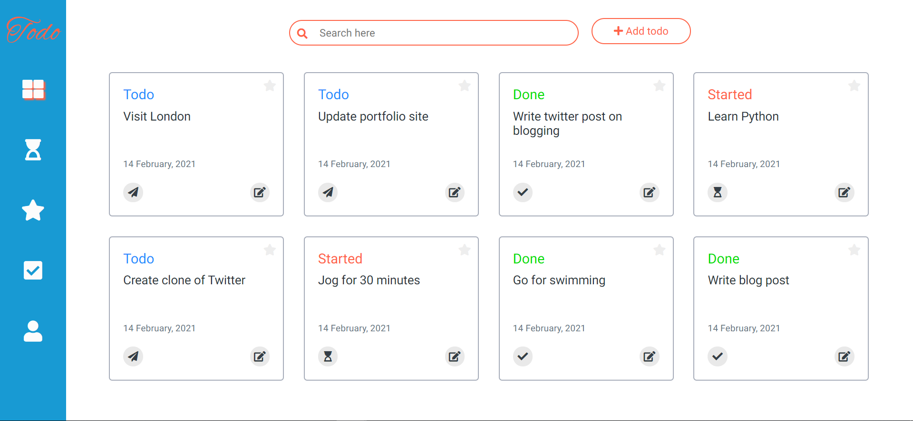

# Todo App

It's a simple todo app where you can add, update, delete your todos and save them to the cloud by logging in to the app. Three login options are available viz., Google, Facebook and Github.

To test the app you can use login as guest option and do CRUD operations.

> For live demo you can visit: https://quicktodoapp.netlify.app/

To clone the app to your local machine use the following commands:

`git clone https://github.com/Basharath/todo.git`

`cd todo`

`npm install`
